<!-- hero: monochrome ASCII portrait beside a neofetch-style info panel. -->
<table>
<tr>
<td valign="top"></td>
<td valign="top"></td>
</tr>
</table>

## Kishan Pokal
**Android Developer · AI Builder · Data Science Enthusiast**

 

<!-- animated contribution graph: replacing the custom heatmap with your Vercel activity graph -->

---

## 🚀 About Me

- 🎯 **Current Focus:** Managing 14-day closed testing cycles on the Google Play Console for upcoming app launches.
- 🎓 **Education:** B.Sc. Computer Science (2022–2025) @ Gujarat University.
- 💡 **Interests:** Integrating local AI models (like Gemma) and smart recommendation systems directly into mobile applications.
- 🌱 **Currently Learning:** Deep Learning neural network structures, Cloud Computing, and advanced UI architecture.

---

## 💻 Featured Projects

| Project | Description | Tech Stack |
| :--- | :--- | :--- |
| **TrackEasy** | Financial management app featuring AI-driven spending predictions, smart recommendations, and dynamic promo assets. | `Kotlin` `Android` `Firebase` |
| **Private Tuition Agent** | Mobile application for private tuition integrated with a local AI model to help students ask questions interactively. | `Android` `Machine Learning` |
| **AttendMate** | Mobile application designed for seamless and efficient attendance tracking and management. | `Kotlin` `Android` |
| **Habit Tracker** | Web application featuring secure user authentication flows and progress analytics. | `Web` `Next.js` `Auth` |

---

## 🛠️ Tech Stack

### 👨‍💻 Languages

### 🌐 Web & Backend

### 🧠 Data Science & AI

---

## 🐍 Contribution Snake

  <picture>
    <source media="(prefers-color-scheme: dark)" srcset="https://raw.githubusercontent.com/kishanpokal/kishanpokal/output/github-contribution-grid-snake-purple.svg">
    <source media="(prefers-color-scheme: light)" srcset="https://raw.githubusercontent.com/kishanpokal/kishanpokal/output/github-contribution-grid-snake.svg">
    
  </picture>

---

### 💡 Daily Dev Quote

 

<!-- FOOTER — commit footer.svg to your repo root -->

  

